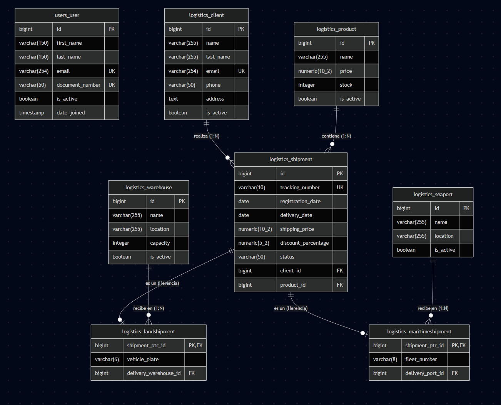

# Sistema de Gestión Logística - SIATA

Este repositorio contiene la solución de la prueba técnica para Desarrollador Full Stack en Universidad Eafit - SIATA.

## Estructura del Proyecto

El proyecto está dividido en dos grandes bloques:

1.  **`app_logistic_api/`**: Backend desarrollado con Django y Django REST Framework.
2.  **`app_logistic_client/`**: Frontend desarrollado con Next.js 15+, React 19 y Tailwind CSS.

---

## Requisitos Previos

- **Python 3.10+**
- **Node.js >=20.9.0**
- **pnpm** (recomendado) o npm/yarn.

---

## Configuración del Backend (`app_logistic_api`)

1.  **Navegar al directorio:**
    ```bash
    cd app_logistic_api
    ```
2.  **Crear y activar entorno virtual:**
    ```bash
    python -m venv venv
    .\venv\Scripts\activate  # Windows
    source venv/bin/activate # Linux/Mac
    ```
3.  **Instalar dependencias:**
    ```bash
    pip install -r requirements.txt
    ```
4.  **Ejecutar migraciones:**
    ```bash
    python manage.py migrate
    ```
5.  **Iniciar servidor de desarrollo:**
    ```bash
    python manage.py runserver
    ```

---

## Configuración del Frontend (`app_logistic_client`)

1.  **Navegar al directorio:**
    ```bash
    cd app_logistic_client
    ```
2.  **Instalar dependencias:**
    ```bash
    pnpm install
    ```
3.  **Configurar variables de entorno:**
    Crea un archivo `.env.local` con:
    ```env
    NEXT_PUBLIC_API_URL=http://localhost:8000/api
    ```
4.  **Iniciar servidor de desarrollo:**
    ```bash
    pnpm dev
    ```

---

## Despliegue con Docker

El proyecto está configurado para ejecutarse fácilmente utilizando Docker y Docker Compose.

1.  **Asegúrate de estar en la raíz del proyecto.**
2.  **Ejecutar el comando:**

    ```bash
    docker-compose up --build
    ```
    *Este comando levantará la base de datos (PostgreSQL), el backend (API) y el frontend (Client) automáticamente localmente.

3.  **Despliegue en la Nube**:
    La solución se encuentra actualmente desplegada en **Vercel** para una demostración rápida.

4.  **Acceso:**
    - **Frontend (Producción)**: [https://siata-test-case-client.vercel.app/](https://siata-test-case-client.vercel.app/)
    - **API (Producción)**: [https://siata-test-case-api.vercel.app/api](https://siata-test-case-api.vercel.app/api)
    - **Local**: [http://localhost:3000](http://localhost:3000)
    - **Base de Datos (SQL)**: [full_db_schema.sql](./full_db_schema.sql)
    - **Diagrama Entidad-Relación**: [DIAGRAMA-ER.png](./DIAGRAMA-ER.png)
    - **Documentación (Postman)**: Puedes importar la colección [Logistic_API.postman_collection.json](./app_logistic_api/Logistic_API.postman_collection.json) en Postman para probar los endpoints.

### Diagrama ER



---

## Decisiones Técnicas y Arquitectura

Para el desarrollo de esta solución, se priorizó la escalabilidad, buena integridad de datos y escalabilidad para futuras implementaciones.

### Justificación de Tecnologías

- **Django REST Framework (DRF)**: Se eligió por su madurez y simplicidad para el manejo de relaciones y modelos de datos; la facilidad de implementar características como autenticación, migraciones de datos, paginación y crud completo.
- **Next.js 15+**: Se seleccionó por su simplicidad y eficiencia en el manejo de rutas y por su optimización.
- **PostgreSQL**: Decidí implementar un modelo de base de datos relacional para garantizar una buena integridad de datos y escalabilidad para una futura implementación.
- **Docker**: Se implementó para asegurar que el sistema funcione exactamente igual en cualquier máquina, orquestando la base de datos, el backend y el frontend con un solo comando.

### Patrones de Diseño y Buenas Prácticas

- **Polimorfismo en modelos de envíos**: Se empleó herencia de modelos para los envíos. Esto permite que `LandShipment` y `MaritimeShipment` compartan una base común (`Shipment`) pero mantengan sus campos específicos según el caso de uso.
- **Borrado Lógico (Soft Delete)**: En lugar de eliminar registros, se utiliza el campo `is_active`. Esto es una buena práctica en sistemas logísticos para mantener la trazabilidad histórica de los datos en caso de querer eliminar información a futuro (lo más apropiado podría ser implementar SnapShots para mantener un historial mas detallado pero por facilidad se optó por el borrado lógico).
- **Gestión Global de Estado**: Se implementó un `UserProvider`, hooks de autenticación y middlewares para manejar el estado global de la aplicación.
- **Validación Robusta**: Se implementaron validaciones multinivel. El backend utiliza expresiones regulares para asegurar formatos como los especificados en la documentación, mientras que el frontend ofrece feedback inmediato al usuario mediante toasts y mensajes por campo.
- **Interceptores de API**: Se utiliza un interceptor centralizado para inyectar automáticamente el token JWT en las peticiones y manejar de mejor forma los errores de autenticación (ej. 401).

---

## Características Principales

### Gestión de Catálogos (CRUD)

- **Clientes**: Registro y administración de clientes.
- **Productos**: Gestión de inventario de productos.
- **Puertos y Bodegas**: Administración de puntos de origen y destino.
- **Estado Activo/Inactivo**: Sistema de borrado lógico mediante `is_active`.

### Módulo de Envíos

- **Envíos Terrestres y Marítimos**: Formulario dinámico que adapta campos según el tipo de transporte.
- **Validaciones Estrictas**:
  - Número de Guía (10 caracteres alfanuméricos).
  - Número de Flota Marítima (Formato: AAA1234A).
- **Descuentos Automáticos**: Aplicación de descuentos por volumen de productos.
- **Gestión de Estados**: Flujo completo desde Pendiente hasta Entregado/Cancelado.

### Seguridad y Experiencia de Usuario

- **Autenticación JWT**: Protección de rutas y persistencia de sesión.
- **User Provider**: Contexto global para mostrar el perfil del usuario en toda la app.
- **Validación en Tiempo Real**: Mensajes de error por campo y transformación automática a MAYÚSCULAS.
- **Diseño Premium**: Interfaz moderna con Tailwind CSS, animaciones suaves y notificaciones interactivas.

---

## Autor

John Manuel Echeverry Hernandez
Desarrollado para el caso técnico de ** EAFIT - SIATA**.
